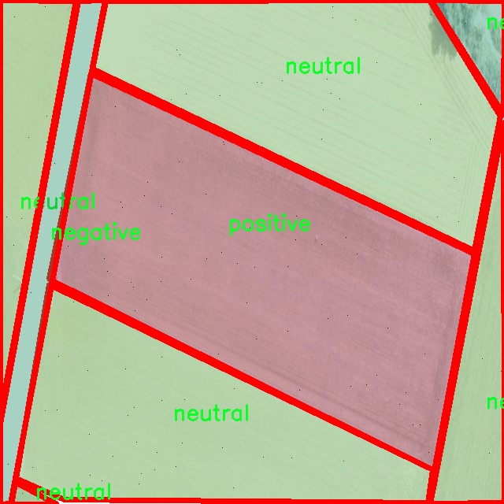

# 农田作物健康状态分割系统： yolov8-seg-C2f-ODConv

### 1.研究背景与意义

[参考博客](https://gitee.com/YOLOv8_YOLOv11_Segmentation_Studio/projects)

[博客来源](https://kdocs.cn/l/cszuIiCKVNis)

研究背景与意义

随着全球人口的持续增长和城市化进程的加快，农业生产面临着前所未有的挑战。作物健康状况的监测与评估已成为确保粮食安全和可持续农业发展的重要环节。传统的农田监测方法往往依赖于人工观察和经验判断，效率低下且易受主观因素影响。因此，利用先进的计算机视觉技术，尤其是深度学习算法，来实现对农田作物健康状态的自动化监测，具有重要的现实意义。

近年来，YOLO（You Only Look Once）系列目标检测算法因其高效性和准确性在计算机视觉领域得到了广泛应用。YOLOv8作为该系列的最新版本，结合了更为先进的网络结构和优化策略，能够在保持高精度的同时显著提高检测速度。针对农田作物健康状态的分割任务，改进YOLOv8模型能够更好地处理复杂的自然场景，快速识别和分割出不同健康状态的作物区域。通过对作物健康状态进行精确的实例分割，农民和农业管理者可以及时获取作物生长的动态信息，从而采取相应的管理措施，提升农业生产效率。

本研究基于一个包含1200幅图像的数据集，涵盖了作物健康状态的三种类别：负面、中性和正面。这一数据集的构建为模型的训练和验证提供了坚实的基础。通过对不同健康状态的作物进行标注，研究者能够训练出一个具有良好泛化能力的分割模型，进而实现对农田作物健康状况的实时监测和评估。此举不仅能够提高作物生长的可视化程度，还能为精准农业提供数据支持，帮助农民在合适的时间采取科学的管理措施，降低生产成本，提高产量。

此外，基于改进YOLOv8的农田作物健康状态分割系统还具有广泛的应用前景。随着农业智能化的不断推进，该系统可以与无人机、传感器等设备相结合，实现自动化的农田监测和管理。这将为农业生产提供更加智能化的解决方案，推动农业向数字化、智能化方向发展。同时，该系统的研究与应用也为相关领域的学术研究提供了新的思路和方法，促进了计算机视觉技术在农业领域的深入应用。

综上所述，基于改进YOLOv8的农田作物健康状态分割系统不仅能够提高作物健康监测的效率和准确性，还为农业生产的智能化转型提供了重要的技术支持。通过本研究的开展，将为实现可持续农业发展、保障粮食安全贡献力量，同时也为相关领域的研究提供了丰富的实践经验和理论基础。

### 2.图片演示


注意：本项目提供完整的训练源码数据集和训练教程,由于此博客编辑较早,暂不提供权重文件（best.pt）,需要按照6.训练教程进行训练后实现上图效果。

### 3.视频演示

[3.1 视频演示](https://www.bilibili.com/video/BV1duBSYeEdT/)

### 4.数据集信息

##### 4.1 数据集类别数＆类别名

nc: 3
names: ['negative', 'neutral', 'positive']


##### 4.2 数据集信息简介

数据集信息展示

在现代农业的智能化发展过程中，作物健康状态的监测与评估成为了提高农作物产量和质量的重要环节。为此，我们构建了一个名为“farmlandProject”的数据集，旨在为改进YOLOv8-seg的农田作物健康状态分割系统提供丰富的数据支持。该数据集的设计充分考虑了农田作物在不同生长阶段的健康状态，通过精细化的标注和分类，力求为模型的训练提供高质量的样本。

“farmlandProject”数据集包含三种主要的健康状态类别，分别为“negative”、“neutral”和“positive”。这三类状态不仅涵盖了作物的健康与否，还反映了作物在不同环境和管理条件下的生长表现。具体而言，“negative”类别代表作物生长不良，可能受到病虫害、营养不足或环境压力等因素的影响；“neutral”类别则指作物处于正常生长状态，但未达到最佳生长效果，可能需要进一步的管理措施；而“positive”类别则表示作物生长良好，展现出健康的生长状态，通常伴随着较高的产量预期。

在数据集的构建过程中，我们收集了来自不同地区和不同作物种类的图像数据，以确保数据的多样性和代表性。每一张图像都经过精确的标注，确保模型在训练过程中能够学习到各类健康状态的特征。为了提高模型的泛化能力，我们还进行了数据增强处理，包括旋转、缩放、裁剪等操作，使得模型能够在面对不同的拍摄角度和光照条件时，依然能够保持良好的识别性能。

此外，为了保证数据集的质量，我们对数据进行了严格的筛选和审核。所有图像均来自于真实的农田环境，经过专业人员的评估和标注，确保每一张图像都能够准确反映作物的健康状态。这种高质量的数据来源为YOLOv8-seg模型的训练提供了坚实的基础，使得模型能够更有效地学习到作物健康状态的特征，从而在实际应用中实现更高的准确率和可靠性。

“farmlandProject”数据集的建立，不仅为改进YOLOv8-seg的农田作物健康状态分割系统提供了重要的数据支持，也为后续的研究和应用奠定了基础。通过对作物健康状态的精准识别，农民和农业管理者能够及时采取措施，优化管理策略，提高作物的产量和质量，进而推动农业的可持续发展。

总之，“farmlandProject”数据集在作物健康状态监测领域具有重要的应用价值。随着智能农业技术的不断发展，我们期待该数据集能够为更多的研究者和从业者提供有力的支持，助力农业的智能化转型与升级。





### 5.项目依赖环境部署教程（零基础手把手教学）

[5.1 环境部署教程链接（零基础手把手教学）](https://www.bilibili.com/video/BV1jG4Ve4E9t/?vd_source=bc9aec86d164b67a7004b996143742dc)


[5.2 安装Python虚拟环境创建和依赖库安装视频教程链接（零基础手把手教学）](https://www.bilibili.com/video/BV1nA4VeYEze/?vd_source=bc9aec86d164b67a7004b996143742dc)

### 6.手把手YOLOV8-seg训练视频教程（零基础手把手教学）

[6.1 手把手YOLOV8-seg训练视频教程（零基础小白有手就能学会）](https://www.bilibili.com/video/BV1cA4VeYETe/?vd_source=bc9aec86d164b67a7004b996143742dc)


按照上面的训练视频教程链接加载项目提供的数据集，运行train.py即可开始训练



     Epoch   gpu_mem       box       obj       cls    labels  img_size
     1/200     0G   0.01576   0.01955  0.007536        22      1280: 100%|██████████| 849/849 [14:42<00:00,  1.04s/it]
               Class     Images     Labels          P          R     mAP@.5 mAP@.5:.95: 100%|██████████| 213/213 [01:14<00:00,  2.87it/s]
                 all       3395      17314      0.994      0.957      0.0957      0.0843

     Epoch   gpu_mem       box       obj       cls    labels  img_size
     2/200     0G   0.01578   0.01923  0.007006        22      1280: 100%|██████████| 849/849 [14:44<00:00,  1.04s/it]
               Class     Images     Labels          P          R     mAP@.5 mAP@.5:.95: 100%|██████████| 213/213 [01:12<00:00,  2.95it/s]
                 all       3395      17314      0.996      0.956      0.0957      0.0845

     Epoch   gpu_mem       box       obj       cls    labels  img_size
     3/200     0G   0.01561    0.0191  0.006895        27      1280: 100%|██████████| 849/849 [10:56<00:00,  1.29it/s]
               Class     Images     Labels          P          R     mAP@.5 mAP@.5:.95: 100%|███████   | 187/213 [00:52<00:00,  4.04it/s]
                 all       3395      17314      0.996      0.957      0.0957      0.0845


### 7.50+种全套YOLOV8-seg创新点加载调参实验视频教程（一键加载写好的改进模型的配置文件）

[7.1 50+种全套YOLOV8-seg创新点加载调参实验视频教程（一键加载写好的改进模型的配置文件）](https://www.bilibili.com/video/BV1Hw4VePEXv/?vd_source=bc9aec86d164b67a7004b996143742dc)

### YOLOV8-seg算法简介

原始YOLOV8-seg算法原理

YOLOv8-seg算法是YOLO系列的最新进展，继承了YOLOv3和YOLOv5的设计理念，同时结合了近年来在目标检测领域的诸多创新。YOLOv8-seg不仅在目标检测上表现出色，还扩展了其功能，能够进行图像分割任务。这一算法的核心在于其独特的网络结构和高效的训练策略，使其在处理复杂场景时展现出更强的鲁棒性和准确性。

首先，YOLOv8-seg算法的网络结构由三个主要部分组成：输入端、主干网络和检测头。输入端负责接收和预处理输入图像，采用了一系列数据增强技术，如马赛克增强、混合增强、空间扰动和颜色扰动，以提升模型的泛化能力。尤其是在训练的最后10个epoch中，YOLOv8-seg停止使用马赛克增强，旨在减少对数据真实分布的干扰，从而使模型更好地学习到目标特征。

在主干网络部分，YOLOv8-seg引入了C2f模块，取代了之前的C3模块。C2f模块的设计灵感来源于YOLOv7中的ELAN模块，增加了更多的残差连接，使得梯度信息在网络中能够更有效地流动。这种设计不仅保持了模型的轻量化，还提升了特征提取的能力。C2f模块的引入使得YOLOv8-seg在多尺度特征融合方面表现得更加出色，能够更好地捕捉不同尺寸目标的特征信息。

YOLOv8-seg继续采用了FPN-PAN结构，这一结构通过特征金字塔的方式有效融合了多尺度信息。FPN（Feature Pyramid Network）和PAN（Path Aggregation Network）的结合，使得网络在处理复杂场景时，能够充分利用不同层次的特征信息，从而提高检测精度。YOLOv8-seg在这一结构中进行了优化，确保了在特征融合的同时，计算效率得以提升。

在检测头部分，YOLOv8-seg采用了解耦合头结构，这一结构将分类和定位任务分开处理。具体而言，检测头由两条并行的分支组成，分别负责提取类别特征和位置特征。通过这种方式，YOLOv8-seg能够更精准地处理分类和定位任务，提升了模型的收敛速度和预测精度。此外，YOLOv8-seg采用了无锚框的结构，直接预测目标的中心位置，并引入了任务对齐学习（Task Alignment Learning）策略，以优化正负样本的匹配。这一策略通过动态调整样本分配，使得模型在训练过程中能够更好地平衡分类和定位的损失，从而提升整体性能。

在损失计算方面，YOLOv8-seg使用了多种损失函数来优化模型的训练过程。分类损失采用了变焦损失（Varifocal Loss），而回归损失则结合了CIoU Loss和DFL Loss。这种损失函数的设计使得模型在处理正负样本时，能够更有效地聚焦于高质量的正样本，同时降低低质量负样本对损失的影响。通过这种方式，YOLOv8-seg能够在复杂场景中实现更高的检测精度和更快的推理速度。

值得一提的是，YOLOv8-seg在训练过程中，充分利用了数据集的多样性和丰富性。通过动态标签分配策略，YOLOv8-seg能够在不同的训练阶段自适应地调整样本的权重，使得模型在学习过程中能够更好地适应数据的分布特征。这一策略不仅提升了模型的鲁棒性，还有效减少了过拟合的风险。

总的来说，YOLOv8-seg算法在YOLO系列的基础上进行了多项创新，尤其是在网络结构、损失计算和样本分配策略等方面的改进，使得其在目标检测和图像分割任务中表现出色。通过引入C2f模块、解耦合头结构和动态标签分配策略，YOLOv8-seg不仅提高了模型的准确性和效率，还为实际应用提供了更为强大的支持。这一算法的推出，标志着目标检测技术的又一次重要进步，具有广泛的研究和应用价值。


### 9.系统功能展示（检测对象为举例，实际内容以本项目数据集为准）

图9.1.系统支持检测结果表格显示

  图9.2.系统支持置信度和IOU阈值手动调节

  图9.3.系统支持自定义加载权重文件best.pt(需要你通过步骤5中训练获得)

  图9.4.系统支持摄像头实时识别

  图9.5.系统支持图片识别

  图9.6.系统支持视频识别

  图9.7.系统支持识别结果文件自动保存

  图9.8.系统支持Excel导出检测结果数据


### 10.50+种全套YOLOV8-seg创新点原理讲解（非科班也可以轻松写刊发刊，V11版本正在科研待更新）

#### 10.1 由于篇幅限制，每个创新点的具体原理讲解就不一一展开，具体见下列网址中的创新点对应子项目的技术原理博客网址【Blog】：


[10.1 50+种全套YOLOV8-seg创新点原理讲解链接](https://gitee.com/qunmasj/good)

#### 10.2 部分改进模块原理讲解(完整的改进原理见上图和技术博客链接)【如果此小节的图加载失败可以通过CSDN或者Github搜索该博客的标题访问原始博客，原始博客图片显示正常】
### CBAM空间注意力机制
近年来，随着深度学习研究方向的火热，注意力机制也被广泛地应用在图像识别、语音识别和自然语言处理等领域，注意力机制在深度学习任务中发挥着举足轻重的作用。注意力机制借鉴于人类的视觉系统，例如，人眼在看到一幅画面时，会倾向于关注画面中的重要信息，而忽略其他可见的信息。深度学习中的注意力机制和人类视觉的注意力机制相似，通过扫描全局数据，从大量数据中选择出需要重点关注的、对当前任务更为重要的信息，然后对这部分信息分配更多的注意力资源，从这些信息中获取更多所需要的细节信息，而抑制其他无用的信息。而在深度学习中，则具体表现为给感兴趣的区域更高的权重，经过网络的学习和调整，得到最优的权重分配，形成网络模型的注意力，使网络拥有更强的学习能力，加快网络的收敛速度。
注意力机制通常可分为软注意力机制和硬注意力机制[4-5]。软注意力机制在选择信息时，不是从输入的信息中只选择1个，而会用到所有输入信息，只是各个信息对应的权重分配不同，然后输入网络模型进行计算;硬注意力机制则是从输入的信息中随机选取一个或者选择概率最高的信息，但是这一步骤通常是不可微的，导致硬注意力机制更难训练。因此，软注意力机制应用更为广泛，按照原理可将软注意力机制划分为:通道注意力机制（channel attention)、空间注意力机制(spatial attention）和混合域注意力机制(mixed attention)。
通道注意力机制的本质建立各个特征通道之间的重要程度，对感兴趣的通道进行重点关注，弱化不感兴趣的通道的作用;空间注意力的本质则是建模了整个空间信息的重要程度，然后对空间内感兴趣的区域进行重点关注，弱化其余非感兴趣区域的作用;混合注意力同时运用了通道注意力和空间注意力，两部分先后进行或并行，形成对通道特征和空间特征同时关注的注意力模型。

卷积层注意力模块(Convolutional Block Attention Module，CBAM）是比较常用的混合注意力模块，其先后集中了通道注意力模块和空间注意力模块，网络中加入该模块能有效提高网络性能，减少网络模型的计算量，模块结构如图所示。输入特征图首先经过分支的通道注意力模块，然后和主干的原特征图融合，得到具有通道注意力的特征图，接着经过分支的空间注意力模块，在和主干的特征图融合后，得到同时具有通道特征注意力和空间特征注意力的特征图。CBAM模块不改变输入特征图的大小，因此该模块是一个“即插即用”的模块，可以插入网络的任何位置。

通道注意力模块的结构示意图如图所示，通道注意力模块分支并行地对输入的特征图进行最大池化操作和平均池化操作，然后利用多层感知机对结果进行变换，得到应用于两个通道的变换结果，最后经过sigmoid激活函数将变换结果融合，得到具有通道注意力的通道特征图。

空间注意力模块示意图如图所示，将通道注意力模块输出的特征图作为该模块的输入特征图，首先对输入特征图进行基于通道的最大池化操作和平均池化操作，将两部分得到的结果拼接起来，然后通过卷积得到降为Ⅰ通道的特征图，最后通过sigmoid激活函数生成具有空间注意力的特征图。


### 11.项目核心源码讲解（再也不用担心看不懂代码逻辑）

#### 11.1 ultralytics\solutions\object_counter.py

以下是对给定代码的核心部分进行提炼和详细注释的结果：

```python
# 导入必要的库
from collections import defaultdict
import cv2
from shapely.geometry import Polygon
from shapely.geometry.point import Point
from ultralytics.utils.plotting import Annotator, colors

class ObjectCounter:
    """用于实时视频流中基于轨迹计数对象的类。"""

    def __init__(self):
        """初始化计数器，设置默认值。"""
        # 鼠标事件相关
        self.is_drawing = False  # 是否正在绘制
        self.selected_point = None  # 当前选中的点

        # 区域信息
        self.reg_pts = None  # 区域点
        self.counting_region = None  # 计数区域
        self.region_color = (255, 255, 255)  # 区域颜色

        # 图像和注释信息
        self.im0 = None  # 当前图像
        self.tf = None  # 线条厚度
        self.view_img = False  # 是否显示图像

        self.names = None  # 类别名称
        self.annotator = None  # 注释器

        # 对象计数信息
        self.in_counts = 0  # 进入计数
        self.out_counts = 0  # 离开计数
        self.counting_list = []  # 计数列表

        # 轨迹信息
        self.track_history = defaultdict(list)  # 轨迹历史
        self.track_thickness = 2  # 轨迹线厚度
        self.draw_tracks = False  # 是否绘制轨迹

    def set_args(self, classes_names, reg_pts, region_color=None, line_thickness=2, track_thickness=2, view_img=False, draw_tracks=False):
        """
        配置计数器的参数，包括类别名称、区域点、颜色和线条厚度等。

        Args:
            classes_names (dict): 类别名称字典
            reg_pts (list): 定义计数区域的点
            region_color (tuple): 区域线条颜色
            line_thickness (int): 边框线条厚度
            track_thickness (int): 轨迹线条厚度
            view_img (bool): 是否显示视频流
            draw_tracks (bool): 是否绘制轨迹
        """
        self.tf = line_thickness
        self.view_img = view_img
        self.track_thickness = track_thickness
        self.draw_tracks = draw_tracks
        self.reg_pts = reg_pts
        self.counting_region = Polygon(self.reg_pts)  # 使用点创建多边形区域
        self.names = classes_names
        self.region_color = region_color if region_color else self.region_color

    def extract_and_process_tracks(self, tracks):
        """
        提取并处理轨迹，进行对象计数。

        Args:
            tracks (list): 从对象跟踪过程中获得的轨迹列表。
        """
        boxes = tracks[0].boxes.xyxy.cpu()  # 获取边界框坐标
        clss = tracks[0].boxes.cls.cpu().tolist()  # 获取类别
        track_ids = tracks[0].boxes.id.int().cpu().tolist()  # 获取轨迹ID

        self.annotator = Annotator(self.im0, self.tf, self.names)  # 初始化注释器
        self.annotator.draw_region(reg_pts=self.reg_pts, color=(0, 255, 0))  # 绘制计数区域

        for box, track_id, cls in zip(boxes, track_ids, clss):
            self.annotator.box_label(box, label=self.names[cls], color=colors(int(cls), True))  # 绘制边界框

            # 更新轨迹
            track_line = self.track_history[track_id]
            track_line.append((float((box[0] + box[2]) / 2), float((box[1] + box[3]) / 2)))  # 记录中心点
            track_line.pop(0) if len(track_line) > 30 else None  # 限制轨迹长度

            if self.draw_tracks:
                self.annotator.draw_centroid_and_tracks(track_line, color=(0, 255, 0), track_thickness=self.track_thickness)  # 绘制轨迹

            # 计数对象
            if self.counting_region.contains(Point(track_line[-1])):  # 检查对象是否在计数区域内
                if track_id not in self.counting_list:  # 如果是新对象
                    self.counting_list.append(track_id)  # 添加到计数列表
                    if box[0] < self.counting_region.centroid.x:  # 判断对象是进入还是离开
                        self.out_counts += 1
                    else:
                        self.in_counts += 1

        # 显示计数结果
        if self.view_img:
            incount_label = 'InCount : ' + f'{self.in_counts}'
            outcount_label = 'OutCount : ' + f'{self.out_counts}'
            self.annotator.count_labels(in_count=incount_label, out_count=outcount_label)  # 显示计数标签
            cv2.imshow('Ultralytics YOLOv8 Object Counter', self.im0)  # 显示图像
            if cv2.waitKey(1) & 0xFF == ord('q'):  # 按'q'退出
                return

    def start_counting(self, im0, tracks):
        """
        启动对象计数过程。

        Args:
            im0 (ndarray): 当前视频流帧。
            tracks (list): 从对象跟踪过程中获得的轨迹列表。
        """
        self.im0 = im0  # 存储当前图像
        if tracks[0].boxes.id is None:  # 如果没有检测到对象，直接返回
            return
        self.extract_and_process_tracks(tracks)  # 提取并处理轨迹

if __name__ == '__main__':
    ObjectCounter()  # 创建对象计数器实例
```

### 代码核心部分分析
1. **类定义与初始化**：`ObjectCounter`类用于管理对象计数的逻辑，初始化时设置了各种参数和状态。
2. **参数设置**：`set_args`方法用于配置计数器的各种参数，包括区域点、颜色、线条厚度等。
3. **轨迹提取与处理**：`extract_and_process_tracks`方法负责从跟踪结果中提取信息，并进行对象计数。
4. **计数逻辑**：通过判断对象的中心点是否在定义的计数区域内来更新进入和离开的计数。
5. **显示与交互**：通过OpenCV显示图像，并允许用户通过鼠标事件修改计数区域。

该代码实现了一个基本的对象计数器，能够在实时视频流中识别并计数进入和离开的对象。

这个文件定义了一个名为 `ObjectCounter` 的类，用于在实时视频流中基于物体的轨迹进行计数。该类的主要功能是通过鼠标事件定义计数区域，并实时跟踪和计数进入和离开该区域的物体。

在初始化方法 `__init__` 中，类的各种参数被设置为默认值，包括鼠标事件的状态、计数区域的信息、图像和注释信息、物体计数信息、轨迹信息等。具体来说，`is_drawing` 用于指示是否正在绘制区域，`selected_point` 用于存储当前选中的点，`reg_pts` 和 `counting_region` 用于定义计数区域，`in_counts` 和 `out_counts` 用于分别记录进入和离开的物体数量。

`set_args` 方法用于配置计数器的参数，包括类名、计数区域的点、区域颜色、线条厚度等。这些参数将影响后续的计数和绘制操作。

`mouse_event_for_region` 方法处理鼠标事件，使用户能够通过鼠标在视频流中绘制和移动计数区域。当用户按下鼠标左键时，如果点击的点在计数区域的某个顶点附近，就会选择该点并开始绘制；在鼠标移动时，如果正在绘制，则更新该点的位置；当鼠标左键抬起时，停止绘制。

`extract_and_process_tracks` 方法是处理物体轨迹的核心。它从输入的轨迹中提取边界框、类别和轨迹ID，并使用 `Annotator` 类绘制计数区域和边界框。对于每个边界框，它会更新轨迹信息，并根据物体的最后位置判断物体是进入还是离开计数区域。计数结果会更新 `in_counts` 和 `out_counts`，并将新进入的物体ID添加到 `counting_list` 中。

如果设置了 `view_img` 为 `True`，则会在窗口中显示当前帧图像，并在图像上显示进入和离开的计数。用户可以通过鼠标交互来调整计数区域。

`start_counting` 方法是启动计数过程的主函数。它接收当前帧图像和物体轨迹作为输入，调用 `extract_and_process_tracks` 方法进行处理。

最后，在文件的主程序部分，创建了 `ObjectCounter` 的实例，但没有进一步的操作。这意味着该类可能是作为模块被其他代码调用，而不是直接运行的脚本。整体来看，这个文件提供了一个实时物体计数的基础框架，结合了图像处理和用户交互功能。

#### 11.2 ultralytics\models\sam\amg.py

以下是代码中最核心的部分，并附上详细的中文注释：

```python
import torch

def is_box_near_crop_edge(boxes: torch.Tensor,
                          crop_box: List[int],
                          orig_box: List[int],
                          atol: float = 20.0) -> torch.Tensor:
    """
    判断给定的边界框是否接近裁剪边缘。

    参数：
    - boxes: 包含多个边界框的张量，格式为 (N, 4)，每个框由 (x1, y1, x2, y2) 表示。
    - crop_box: 当前裁剪框的坐标 [x0, y0, x1, y1]。
    - orig_box: 原始图像的边界框坐标 [x0, y0, x1, y1]。
    - atol: 允许的绝对误差，默认为 20.0。

    返回：
    - 返回一个布尔张量，指示每个边界框是否接近裁剪边缘。
    """
    # 将裁剪框和原始框转换为张量
    crop_box_torch = torch.as_tensor(crop_box, dtype=torch.float, device=boxes.device)
    orig_box_torch = torch.as_tensor(orig_box, dtype=torch.float, device=boxes.device)
    
    # 将边界框从裁剪坐标系转换回原始坐标系
    boxes = uncrop_boxes_xyxy(boxes, crop_box).float()
    
    # 检查边界框是否接近裁剪框的边缘
    near_crop_edge = torch.isclose(boxes, crop_box_torch[None, :], atol=atol, rtol=0)
    # 检查边界框是否接近原始图像的边缘
    near_image_edge = torch.isclose(boxes, orig_box_torch[None, :], atol=atol, rtol=0)
    
    # 只有当边界框接近裁剪边缘且不接近原始图像边缘时，才认为它接近裁剪边缘
    near_crop_edge = torch.logical_and(near_crop_edge, ~near_image_edge)
    
    # 返回是否有任何边界框接近裁剪边缘
    return torch.any(near_crop_edge, dim=1)


def uncrop_boxes_xyxy(boxes: torch.Tensor, crop_box: List[int]) -> torch.Tensor:
    """
    将边界框从裁剪坐标系转换回原始坐标系。

    参数：
    - boxes: 包含多个边界框的张量，格式为 (N, 4)，每个框由 (x1, y1, x2, y2) 表示。
    - crop_box: 当前裁剪框的坐标 [x0, y0, x1, y1]。

    返回：
    - 返回转换后的边界框张量。
    """
    x0, y0, _, _ = crop_box
    # 创建偏移量张量
    offset = torch.tensor([[x0, y0, x0, y0]], device=boxes.device)
    
    # 检查 boxes 是否有通道维度
    if len(boxes.shape) == 3:
        offset = offset.unsqueeze(1)
    
    # 返回加上偏移量后的边界框
    return boxes + offset


def batched_mask_to_box(masks: torch.Tensor) -> torch.Tensor:
    """
    计算掩膜周围的边界框，返回格式为 XYXY。

    参数：
    - masks: 二进制掩膜张量，形状为 C1xC2x...xHxW。

    返回：
    - 返回边界框的张量，形状为 C1xC2x...x4。
    """
    # 如果掩膜为空，返回 [0, 0, 0, 0]
    if torch.numel(masks) == 0:
        return torch.zeros(*masks.shape[:-2], 4, device=masks.device)

    # 规范化形状为 CxHxW
    shape = masks.shape
    h, w = shape[-2:]
    masks = masks.flatten(0, -3) if len(shape) > 2 else masks.unsqueeze(0)
    
    # 获取上下边缘
    in_height, _ = torch.max(masks, dim=-1)
    in_height_coords = in_height * torch.arange(h, device=in_height.device)[None, :]
    bottom_edges, _ = torch.max(in_height_coords, dim=-1)
    in_height_coords = in_height_coords + h * (~in_height)
    top_edges, _ = torch.min(in_height_coords, dim=-1)

    # 获取左右边缘
    in_width, _ = torch.max(masks, dim=-2)
    in_width_coords = in_width * torch.arange(w, device=in_width.device)[None, :]
    right_edges, _ = torch.max(in_width_coords, dim=-1)
    in_width_coords = in_width_coords + w * (~in_width)
    left_edges, _ = torch.min(in_width_coords, dim=-1)

    # 如果掩膜为空，右边缘会在左边缘的左侧，替换这些框为 [0, 0, 0, 0]
    empty_filter = (right_edges < left_edges) | (bottom_edges < top_edges)
    out = torch.stack([left_edges, top_edges, right_edges, bottom_edges], dim=-1)
    out = out * (~empty_filter).unsqueeze(-1)

    # 返回到原始形状
    return out.reshape(*shape[:-2], 4) if len(shape) > 2 else out[0]
```

### 代码核心部分说明：
1. **`is_box_near_crop_edge`**: 该函数用于判断给定的边界框是否接近裁剪框的边缘。它通过比较边界框与裁剪框和原始图像框的距离来确定接近程度。

2. **`uncrop_boxes_xyxy`**: 该函数用于将裁剪坐标系中的边界框转换回原始图像坐标系。它通过添加裁剪框的偏移量来实现。

3. **`batched_mask_to_box`**: 该函数用于从二进制掩膜中计算出边界框。它处理多通道的掩膜，并返回每个掩膜的边界框坐标。

这个程序文件 `ultralytics\models\sam\amg.py` 是一个用于处理图像分割和目标检测的模块，主要包含了一些与图像裁剪、掩膜处理和坐标转换相关的函数。以下是对代码的详细讲解。

首先，文件引入了一些必要的库，包括 `math`、`itertools`、`numpy` 和 `torch`，其中 `torch` 是 PyTorch 的核心库，用于张量操作和深度学习计算。

接下来，定义了多个函数：

1. **is_box_near_crop_edge**：该函数用于判断给定的边界框是否接近裁剪边缘。它将裁剪框和原始框转换为张量，并通过比较来确定哪些框接近裁剪边缘，返回一个布尔张量。

2. **batch_iterator**：这个生成器函数用于从输入参数中按批次生成数据。它确保所有输入参数的长度相同，并根据指定的批次大小返回相应的数据。

3. **calculate_stability_score**：此函数计算一组掩膜的稳定性分数，稳定性分数是通过对掩膜进行阈值处理后计算的交并比（IoU）。它返回一个张量，表示每个掩膜的稳定性。

4. **build_point_grid**：生成一个二维网格，网格中的点均匀分布在 [0,1] x [0,1] 的范围内，点的数量由参数 `n_per_side` 决定。

5. **build_all_layer_point_grids**：该函数为所有裁剪层生成点网格，层数和每层的缩放比例由参数决定。

6. **generate_crop_boxes**：生成不同大小的裁剪框列表。每一层的裁剪框数量与层级相关，考虑了重叠比例，并返回裁剪框和对应的层索引。

7. **uncrop_boxes_xyxy**：将裁剪框的坐标转换为原始图像坐标，通过添加裁剪框的偏移量来实现。

8. **uncrop_points**：类似于 `uncrop_boxes_xyxy`，但该函数用于将点的坐标转换为原始图像坐标。

9. **uncrop_masks**：将掩膜从裁剪区域扩展到原始图像大小，通过填充的方式实现。

10. **remove_small_regions**：此函数用于去除掩膜中的小区域或孔洞，返回处理后的掩膜和一个指示是否进行了修改的布尔值。

11. **batched_mask_to_box**：计算掩膜周围的边界框，返回边界框的坐标。对于空掩膜，返回 [0,0,0,0]。

整个文件的设计旨在支持图像处理任务，特别是在目标检测和分割中，提供了裁剪、掩膜处理和坐标转换等功能。这些函数可以在更复杂的模型中被调用，以实现高效的图像分析和处理。

#### 11.3 ultralytics\utils\callbacks\raytune.py

以下是经过简化和注释的核心代码部分：

```python
# 导入必要的库
from ultralytics.utils import SETTINGS

# 尝试导入Ray和Ray Tune库，并检查Ray Tune集成是否启用
try:
    assert SETTINGS['raytune'] is True  # 验证Ray Tune集成是否启用
    import ray
    from ray import tune
    from ray.air import session
except (ImportError, AssertionError):
    tune = None  # 如果导入失败或集成未启用，则将tune设置为None

def on_fit_epoch_end(trainer):
    """在每个训练周期结束时，将训练指标发送到Ray Tune。"""
    if ray.tune.is_session_enabled():  # 检查Ray Tune会话是否启用
        metrics = trainer.metrics  # 获取当前训练指标
        metrics['epoch'] = trainer.epoch  # 添加当前周期信息
        session.report(metrics)  # 将指标报告给Ray Tune

# 定义回调函数字典，如果tune可用，则包含on_fit_epoch_end回调
callbacks = {
    'on_fit_epoch_end': on_fit_epoch_end,
} if tune else {}
```

### 代码说明：
1. **导入库**：首先导入了`SETTINGS`，用于获取配置参数。
2. **集成检查**：通过`try`语句块尝试导入Ray及其Tune模块，并检查Ray Tune是否启用。如果未启用或导入失败，则将`tune`设置为`None`。
3. **回调函数**：定义了`on_fit_epoch_end`函数，该函数在每个训练周期结束时被调用。它会检查Ray Tune会话是否启用，并将当前的训练指标（包括当前周期）报告给Ray Tune。
4. **回调字典**：根据`tune`的可用性，创建一个包含回调函数的字典，以便在训练过程中使用。

这个程序文件是一个用于与Ray Tune集成的回调函数模块，主要用于在训练过程中将训练指标发送到Ray Tune，以便进行超参数调优和模型性能监控。

首先，文件导入了`SETTINGS`，这是一个包含配置设置的字典。接着，程序尝试验证Ray Tune的集成是否启用，即检查`SETTINGS`字典中的`raytune`键是否为`True`。如果集成启用，程序将导入Ray库及其`tune`模块和`session`模块。如果导入失败或集成未启用，`tune`将被设置为`None`，这意味着后续的回调功能将无法使用。

接下来，定义了一个名为`on_fit_epoch_end`的函数，该函数在每个训练周期结束时被调用。它的作用是将当前的训练指标发送到Ray Tune。具体来说，函数首先检查Ray Tune的会话是否已启用，如果启用，则从训练器（trainer）中获取当前的训练指标，并将当前的周期数（epoch）添加到指标中。最后，使用`session.report(metrics)`将这些指标报告给Ray Tune。

最后，程序创建了一个名为`callbacks`的字典，其中包含`on_fit_epoch_end`回调函数的引用，前提是`tune`不为`None`。如果`tune`为`None`，则`callbacks`字典将为空。这使得在使用Ray Tune时，可以灵活地添加回调函数，而在未启用Ray Tune时则不会引发错误。

总体而言，这个文件的主要功能是实现与Ray Tune的集成，便于在训练过程中监控和优化模型性能。

#### 11.4 ultralytics\nn\extra_modules\kernel_warehouse.py

以下是经过简化和注释的核心代码部分，主要包括 `Attention` 类和 `KWConvNd` 类的实现，以及 `Warehouse_Manager` 类的相关功能。注释详细解释了每个部分的功能和作用。

```python
import torch
import torch.nn as nn
import torch.nn.functional as F

class Attention(nn.Module):
    def __init__(self, in_planes, reduction, num_static_cell, num_local_mixture, norm_layer=nn.BatchNorm1d,
                 cell_num_ratio=1.0, nonlocal_basis_ratio=1.0, start_cell_idx=None):
        super(Attention, self).__init__()
        # 计算隐藏层的通道数
        hidden_planes = max(int(in_planes * reduction), 16)
        self.kw_planes_per_mixture = num_static_cell + 1  # 每个混合物的通道数
        self.num_local_mixture = num_local_mixture  # 本地混合物的数量
        self.kw_planes = self.kw_planes_per_mixture * num_local_mixture  # 总通道数

        # 计算本地和非本地单元的数量
        self.num_local_cell = int(cell_num_ratio * num_local_mixture)
        self.num_nonlocal_cell = num_static_cell - self.num_local_cell
        self.start_cell_idx = start_cell_idx

        # 定义层
        self.avgpool = nn.AdaptiveAvgPool1d(1)  # 自适应平均池化
        self.fc1 = nn.Linear(in_planes, hidden_planes, bias=(norm_layer is not nn.BatchNorm1d))  # 线性层
        self.norm1 = norm_layer(hidden_planes)  # 归一化层
        self.act1 = nn.ReLU(inplace=True)  # 激活函数

        # 根据非本地基数比率选择映射方式
        if nonlocal_basis_ratio >= 1.0:
            self.map_to_cell = nn.Identity()  # 直接映射
            self.fc2 = nn.Linear(hidden_planes, self.kw_planes, bias=True)  # 线性层
        else:
            self.map_to_cell = self.map_to_cell_basis  # 使用基于映射
            self.num_basis = max(int(self.num_nonlocal_cell * nonlocal_basis_ratio), 16)  # 基础数量
            self.fc2 = nn.Linear(hidden_planes, (self.num_local_cell + self.num_basis + 1) * num_local_mixture, bias=False)
            self.fc3 = nn.Linear(self.num_basis, self.num_nonlocal_cell, bias=False)  # 线性层
            self.basis_bias = nn.Parameter(torch.zeros([self.kw_planes], requires_grad=True).float())  # 基础偏置

        self.temp_bias = torch.zeros([self.kw_planes], requires_grad=False).float()  # 温度偏置
        self.temp_value = 0  # 温度值
        self._initialize_weights()  # 初始化权重

    def _initialize_weights(self):
        # 初始化权重
        for m in self.modules():
            if isinstance(m, nn.Linear):
                nn.init.kaiming_normal_(m.weight, mode='fan_out', nonlinearity='relu')  # Kaiming初始化
                if m.bias is not None:
                    nn.init.constant_(m.bias, 0)  # 偏置初始化为0
            if isinstance(m, nn.BatchNorm1d):
                nn.init.constant_(m.weight, 1)  # 归一化权重初始化为1
                nn.init.constant_(m.bias, 0)  # 偏置初始化为0

    def forward(self, x):
        # 前向传播
        x = self.avgpool(x.reshape(*x.shape[:2], -1)).squeeze(dim=-1)  # 池化
        x = self.act1(self.norm1(self.fc1(x)))  # 线性变换 + 归一化 + 激活
        x = self.map_to_cell(self.fc2(x)).reshape(-1, self.kw_planes)  # 映射到单元
        x = x / (torch.sum(torch.abs(x), dim=1).view(-1, 1) + 1e-3)  # 归一化
        x = (1.0 - self.temp_value) * x.reshape(-1, self.kw_planes) + self.temp_value * self.temp_bias.to(x.device).view(1, -1)  # 温度调整
        return x.reshape(-1, self.kw_planes_per_mixture)[:, :-1]  # 返回结果

class KWconvNd(nn.Module):
    def __init__(self, in_planes, out_planes, kernel_size, stride=1, padding=0, dilation=1, groups=1,
                 bias=False, warehouse_id=None, warehouse_manager=None):
        super(KWconvNd, self).__init__()
        # 初始化卷积层参数
        self.in_planes = in_planes
        self.out_planes = out_planes
        self.kernel_size = kernel_size  # 卷积核大小
        self.stride = stride  # 步幅
        self.padding = padding  # 填充
        self.dilation = dilation  # 膨胀
        self.groups = groups  # 分组卷积
        self.bias = nn.Parameter(torch.zeros([self.out_planes]), requires_grad=True).float() if bias else None  # 偏置
        self.warehouse_id = warehouse_id  # 仓库ID
        self.warehouse_manager = [warehouse_manager]  # 仓库管理器

    def forward(self, x):
        # 前向传播
        kw_attention = self.attention(x).type(x.dtype)  # 获取注意力权重
        batch_size = x.shape[0]  # 批大小
        x = x.reshape(1, -1, *x.shape[2:])  # 重塑输入
        weight = self.warehouse_manager[0].take_cell(self.warehouse_id).reshape(self.cell_shape[0], -1).type(x.dtype)  # 获取权重
        aggregate_weight = torch.mm(kw_attention, weight)  # 权重聚合
        output = self.func_conv(x, weight=aggregate_weight, bias=None, stride=self.stride, padding=self.padding,
                                dilation=self.dilation, groups=self.groups * batch_size)  # 卷积操作
        output = output.view(batch_size, self.out_planes, *output.shape[2:])  # 重塑输出
        if self.bias is not None:
            output = output + self.bias.reshape(1, -1, *([1]*self.dimension))  # 添加偏置
        return output

class Warehouse_Manager(nn.Module):
    def __init__(self, reduction=0.0625, cell_num_ratio=1, cell_inplane_ratio=1,
                 cell_outplane_ratio=1, sharing_range=(), nonlocal_basis_ratio=1,
                 norm_layer=nn.BatchNorm1d, spatial_partition=True):
        super(Warehouse_Manager, self).__init__()
        # 初始化仓库管理器参数
        self.sharing_range = sharing_range  # 共享范围
        self.warehouse_list = {}  # 仓库列表
        self.reduction = reduction  # 降维比例
        self.spatial_partition = spatial_partition  # 空间分区
        self.cell_num_ratio = cell_num_ratio  # 单元数量比例
        self.cell_outplane_ratio = cell_outplane_ratio  # 输出通道比例
        self.cell_inplane_ratio = cell_inplane_ratio  # 输入通道比例
        self.norm_layer = norm_layer  # 归一化层
        self.nonlocal_basis_ratio = nonlocal_basis_ratio  # 非本地基数比例
        self.weights = nn.ParameterList()  # 权重列表

    def reserve(self, in_planes, out_planes, kernel_size=1, stride=1, padding=0, dilation=1, groups=1,
                bias=True, warehouse_name='default', enabled=True, layer_type='conv2d'):
        # 创建动态卷积层并记录其信息
        if not enabled:
            return nn.Conv2d(in_planes, out_planes, kernel_size, stride=stride, padding=padding, dilation=dilation,
                             groups=groups, bias=bias)  # 返回普通卷积层
        else:
            weight_shape = [out_planes, in_planes // groups, *kernel_size]  # 权重形状
            if warehouse_name not in self.warehouse_list.keys():
                self.warehouse_list[warehouse_name] = []  # 初始化仓库
            self.warehouse_list[warehouse_name].append(weight_shape)  # 记录权重形状
            return KWConv2d(in_planes, out_planes, kernel_size, stride=stride, padding=padding,
                             dilation=dilation, groups=groups, bias=bias,
                             warehouse_id=int(list(self.warehouse_list.keys()).index(warehouse_name)),
                             warehouse_manager=self)  # 返回自定义卷积层
```

### 代码说明
1. **Attention 类**：实现了一个注意力机制，用于动态调整卷积层的权重。包含了权重初始化、前向传播和温度更新等功能。
2. **KWconvNd 类**：是一个通用的卷积层类，支持多维卷积操作，包含了卷积参数的初始化和前向传播的实现。
3. **Warehouse_Manager 类**：管理卷积层的权重，支持动态创建卷积层并记录其信息，提供权重的存储和分配功能。

这些类共同构成了一个灵活的卷积神经网络模块，能够根据输入动态调整卷积权重，提高模型的表达能力。

这个程序文件 `kernel_warehouse.py` 是一个用于深度学习模型的模块，主要实现了一个内核仓库管理器和相关的卷积操作。它利用 PyTorch 框架，定义了一些类和函数来处理卷积层的内核管理和注意力机制。

首先，文件中导入了一些必要的库，包括 PyTorch 的核心模块和一些功能模块。接着，定义了一个 `parse` 函数，用于解析输入参数，以确保它们的格式符合预期。

接下来，定义了一个 `Attention` 类，它是一个神经网络模块，负责实现注意力机制。该类的构造函数接收多个参数，包括输入通道数、缩减比例、静态单元数量、局部混合数量等。它内部定义了一些线性层和归一化层，并在 `_initialize_weights` 方法中初始化这些层的权重。`forward` 方法实现了前向传播过程，计算输入数据的注意力权重。

`KWconvNd` 类是一个基于 `nn.Module` 的卷积层类，负责处理多维卷积操作。它的构造函数接收卷积的输入输出通道、核大小、步幅、填充等参数，并根据这些参数解析出相应的维度信息。`init_attention` 方法用于初始化注意力机制，而 `forward` 方法则实现了卷积操作的前向传播。

接着，定义了 `KWConv1d`、`KWConv2d` 和 `KWConv3d` 类，分别用于一维、二维和三维卷积操作。这些类继承自 `KWconvNd`，并设置了相应的维度和卷积函数。

`KWLinear` 类是一个线性层的实现，内部使用 `KWConv1d` 来处理输入数据。

`Warehouse_Manager` 类是内核仓库的管理器，负责管理卷积层的内核。它的构造函数接收多个参数，用于设置内核的缩减比例、输入输出通道比例等。`reserve` 方法用于创建动态卷积层而不实际分配权重，并记录相关信息。`store` 方法用于存储内核信息并计算相应的参数。`allocate` 方法则用于分配内核并初始化权重。

最后，定义了 `KWConv` 类，它结合了卷积层和批归一化层，并可选择性地添加激活函数。`get_temperature` 函数用于计算温度值，这在训练过程中可能用于调节模型的学习率或其他超参数。

总体而言，这个文件实现了一个灵活的内核管理系统，结合了注意力机制和动态卷积层，旨在提高深度学习模型的效率和性能。

#### 11.5 ultralytics\data\base.py

以下是代码中最核心的部分，并附上详细的中文注释：

```python
class BaseDataset(Dataset):
    """
    基础数据集类，用于加载和处理图像数据。

    参数:
        img_path (str): 图像文件夹的路径。
        imgsz (int, optional): 图像大小，默认为640。
        cache (bool, optional): 在训练期间将图像缓存到RAM或磁盘，默认为False。
        augment (bool, optional): 如果为True，则应用数据增强，默认为True。
        hyp (dict, optional): 应用数据增强的超参数，默认为None。
        prefix (str, optional): 日志消息中打印的前缀，默认为''。
        rect (bool, optional): 如果为True，则使用矩形训练，默认为False。
        batch_size (int, optional): 批次大小，默认为None。
        stride (int, optional): 步幅，默认为32。
        pad (float, optional): 填充，默认为0.0。
        single_cls (bool, optional): 如果为True，则使用单类训练，默认为False。
        classes (list): 包含的类的列表，默认为None。
        fraction (float): 使用的数据集的比例，默认为1.0（使用所有数据）。

    属性:
        im_files (list): 图像文件路径列表。
        labels (list): 标签数据字典列表。
        ni (int): 数据集中图像的数量。
        ims (list): 加载的图像列表。
        npy_files (list): numpy文件路径列表。
        transforms (callable): 图像转换函数。
    """

    def __init__(self, img_path, imgsz=640, cache=False, augment=True, hyp=DEFAULT_CFG, prefix='', rect=False, batch_size=16, stride=32, pad=0.5, single_cls=False, classes=None, fraction=1.0):
        """使用给定的配置和选项初始化BaseDataset。"""
        super().__init__()
        self.img_path = img_path  # 图像路径
        self.imgsz = imgsz  # 图像大小
        self.augment = augment  # 是否应用数据增强
        self.single_cls = single_cls  # 是否使用单类训练
        self.prefix = prefix  # 日志前缀
        self.fraction = fraction  # 使用的数据集比例
        self.im_files = self.get_img_files(self.img_path)  # 获取图像文件
        self.labels = self.get_labels()  # 获取标签
        self.update_labels(include_class=classes)  # 更新标签以仅包含指定类
        self.ni = len(self.labels)  # 数据集中图像的数量
        self.rect = rect  # 是否使用矩形训练
        self.batch_size = batch_size  # 批次大小
        self.stride = stride  # 步幅
        self.pad = pad  # 填充
        if self.rect:
            assert self.batch_size is not None  # 确保批次大小已定义
            self.set_rectangle()  # 设置矩形训练

        # 处理增强图像的缓冲区
        self.buffer = []  # 缓冲区大小 = 批次大小
        self.max_buffer_length = min((self.ni, self.batch_size * 8, 1000)) if self.augment else 0  # 最大缓冲区长度

        # 缓存图像
        if cache == 'ram' and not self.check_cache_ram():
            cache = False  # 如果内存不足，则不缓存
        self.ims, self.im_hw0, self.im_hw = [None] * self.ni, [None] * self.ni, [None] * self.ni  # 初始化图像和尺寸
        self.npy_files = [Path(f).with_suffix('.npy') for f in self.im_files]  # numpy文件路径
        if cache:
            self.cache_images(cache)  # 缓存图像

        # 转换
        self.transforms = self.build_transforms(hyp=hyp)  # 构建图像转换

    def get_img_files(self, img_path):
        """读取图像文件。"""
        try:
            f = []  # 图像文件列表
            for p in img_path if isinstance(img_path, list) else [img_path]:
                p = Path(p)  # 适应不同操作系统
                if p.is_dir():  # 如果是目录
                    f += glob.glob(str(p / '**' / '*.*'), recursive=True)  # 递归获取所有图像文件
                elif p.is_file():  # 如果是文件
                    with open(p) as t:
                        t = t.read().strip().splitlines()  # 读取文件内容
                        parent = str(p.parent) + os.sep
                        f += [x.replace('./', parent) if x.startswith('./') else x for x in t]  # 转换为全局路径
                else:
                    raise FileNotFoundError(f'{self.prefix}{p} does not exist')  # 文件或目录不存在
            im_files = sorted(x.replace('/', os.sep) for x in f if x.split('.')[-1].lower() in IMG_FORMATS)  # 过滤图像格式
            assert im_files, f'{self.prefix}No images found in {img_path}'  # 确保找到图像
        except Exception as e:
            raise FileNotFoundError(f'{self.prefix}Error loading data from {img_path}\n{HELP_URL}') from e
        if self.fraction < 1:
            im_files = im_files[:round(len(im_files) * self.fraction)]  # 根据比例筛选图像
        return im_files

    def load_image(self, i, rect_mode=True):
        """从数据集中加载一张图像，返回图像及其调整后的尺寸。"""
        im, f, fn = self.ims[i], self.im_files[i], self.npy_files[i]  # 获取图像、文件路径和numpy文件路径
        if im is None:  # 如果图像未缓存
            if fn.exists():  # 如果存在numpy文件
                try:
                    im = np.load(fn)  # 加载numpy文件
                except Exception as e:
                    LOGGER.warning(f'{self.prefix}WARNING ⚠️ Removing corrupt *.npy image file {fn} due to: {e}')  # 警告并删除损坏的文件
                    Path(fn).unlink(missing_ok=True)  # 删除损坏的文件
                    im = cv2.imread(f)  # 读取图像
            else:  # 读取图像
                im = cv2.imread(f)  # 读取图像
            if im is None:
                raise FileNotFoundError(f'Image Not Found {f}')  # 图像未找到

            h0, w0 = im.shape[:2]  # 获取原始高度和宽度
            if rect_mode:  # 如果使用矩形模式
                r = self.imgsz / max(h0, w0)  # 计算缩放比例
                if r != 1:  # 如果尺寸不相等
                    w, h = (min(math.ceil(w0 * r), self.imgsz), min(math.ceil(h0 * r), self.imgsz))  # 计算调整后的宽度和高度
                    im = cv2.resize(im, (w, h), interpolation=cv2.INTER_LINEAR)  # 调整图像大小
            elif not (h0 == w0 == self.imgsz):  # 如果不是正方形
                im = cv2.resize(im, (self.imgsz, self.imgsz), interpolation=cv2.INTER_LINEAR)  # 按照正方形调整图像大小

            # 如果使用增强，则将图像添加到缓冲区
            if self.augment:
                self.ims[i], self.im_hw0[i], self.im_hw[i] = im, (h0, w0), im.shape[:2]  # 缓存图像和尺寸
                self.buffer.append(i)  # 将索引添加到缓冲区
                if len(self.buffer) >= self.max_buffer_length:  # 如果缓冲区已满
                    j = self.buffer.pop(0)  # 移除最旧的索引
                    self.ims[j], self.im_hw0[j], self.im_hw[j] = None, None, None  # 清空缓存

            return im, (h0, w0), im.shape[:2]  # 返回图像及其尺寸

        return self.ims[i], self.im_hw0[i], self.im_hw[i]  # 返回缓存的图像及其尺寸

    def __getitem__(self, index):
        """返回给定索引的转换标签信息。"""
        return self.transforms(self.get_image_and_label(index))  # 应用转换并返回标签信息

    def __len__(self):
        """返回数据集中标签列表的长度。"""
        return len(self.labels)  # 返回标签数量

    def build_transforms(self, hyp=None):
        """
        用户可以在此自定义增强。

        示例:
            ```python
            if self.augment:
                # 训练转换
                return Compose([])
            else:
                # 验证转换
                return Compose([])
            ```
        """
        raise NotImplementedError  # 需要实现具体的转换逻辑

    def get_labels(self):
        """
        用户可以在此自定义标签格式。

        注意:
            确保输出是一个包含以下键的字典:
            ```python
            dict(
                im_file=im_file,
                shape=shape,  # 格式: (高度, 宽度)
                cls=cls,
                bboxes=bboxes, # xywh
                segments=segments,  # xy
                keypoints=keypoints, # xy
                normalized=True, # 或 False
                bbox_format="xyxy",  # 或 xywh, ltwh
            )
            ```
        """
        raise NotImplementedError  # 需要实现具体的标签获取逻辑
```

### 代码核心部分说明：
1. **BaseDataset类**：继承自`Dataset`，用于加载和处理图像数据，提供了多种配置选项以适应不同的训练需求。
2. **初始化方法**：负责初始化数据集的基本参数，加载图像文件和标签，并设置图像缓存。
3. **get_img_files方法**：读取指定路径下的图像文件，支持目录和文件列表的输入。
4. **load_image方法**：根据索引加载图像，支持从缓存或磁盘加载，并进行尺寸调整。
5. **getitem和len方法**：实现了数据集的索引和长度方法，使得该类可以被用于PyTorch的数据加载器。
6. **build_transforms和get_labels方法**：提供了自定义数据增强和标签格式的接口，具体实现需要用户根据需求进行定义。

这个程序文件定义了一个名为 `BaseDataset` 的类，主要用于加载和处理图像数据，特别是在计算机视觉任务中，通常用于训练深度学习模型。该类继承自 PyTorch 的 `Dataset` 类，提供了一系列功能以便于数据的读取、预处理和增强。

在初始化方法 `__init__` 中，类接收多个参数，包括图像路径、图像大小、是否缓存图像、数据增强选项、超参数、批量大小等。根据这些参数，类会加载图像文件、标签数据，并根据需要进行数据增强和缓存。

`get_img_files` 方法用于读取指定路径下的图像文件，支持目录和文件的输入，并返回符合要求的图像文件路径列表。该方法还会根据设置的比例（fraction）来决定使用多少数据。

`update_labels` 方法则用于更新标签信息，以便只包含指定的类别。这对于单类训练或特定类别的选择非常有用。

`load_image` 方法负责加载单张图像，并根据需要进行调整（如改变大小和填充）。如果图像已经被缓存，则直接返回缓存的图像。

`cache_images` 和 `cache_images_to_disk` 方法用于将图像缓存到内存或磁盘，以提高后续加载的速度。`check_cache_ram` 方法则用于检查系统内存是否足够，以决定是否将图像缓存到内存中。

`set_rectangle` 方法用于设置 YOLO 检测的边界框形状为矩形，确保在训练时能够适应不同的图像形状。

`__getitem__` 方法返回给定索引的图像和标签信息，并应用相应的转换。`get_image_and_label` 方法则获取图像和标签的详细信息，包括原始形状和调整后的形状。

`__len__` 方法返回数据集中标签的数量。

`update_labels_info` 方法允许用户自定义标签格式，`build_transforms` 和 `get_labels` 方法则是留给用户实现自定义数据增强和标签读取逻辑的接口。

总的来说，这个类为图像数据的加载、处理和增强提供了一个灵活的框架，适用于各种计算机视觉任务，尤其是在使用 YOLO 等目标检测模型时。

### 12.系统整体结构（节选）

### 程序整体功能和构架概括

该程序是一个用于计算机视觉任务的深度学习框架，特别是针对目标检测和图像分割的应用。它包含多个模块，各自负责不同的功能，如数据处理、模型构建、注意力机制、回调函数管理以及内核管理等。整体架构旨在提供灵活性和可扩展性，以便用户可以根据需求进行自定义和优化。

- **数据处理**：提供了数据集的加载、预处理和增强功能，以便于训练模型。
- **模型构建**：实现了卷积层和注意力机制，支持动态卷积和高效的内核管理。
- **训练监控**：集成了与 Ray Tune 的回调功能，以便于超参数调优和性能监控。
- **目标计数**：实现了实时目标计数的功能，结合了用户交互和图像处理。

### 文件功能整理表

| 文件路径                                         | 功能描述                                                                 |
|--------------------------------------------------|--------------------------------------------------------------------------|
| `ultralytics/solutions/object_counter.py`       | 实现实时目标计数的功能，支持用户定义计数区域并跟踪物体的进入和离开。   |
| `ultralytics/models/sam/amg.py`                 | 提供图像分割和目标检测的模块，包含注意力机制和卷积操作的实现。         |
| `ultralytics/utils/callbacks/raytune.py`        | 集成与 Ray Tune 的回调函数，便于在训练过程中监控和优化模型性能。       |
| `ultralytics/nn/extra_modules/kernel_warehouse.py` | 实现内核管理和动态卷积层，结合注意力机制以提高模型效率。               |
| `ultralytics/data/base.py`                       | 定义数据集加载和处理的基础类，支持图像的预处理和增强功能。             |

这个表格清晰地展示了每个文件的主要功能，有助于理解整个程序的架构和模块之间的关系。

### 13.图片、视频、摄像头图像分割Demo(去除WebUI)代码

在这个博客小节中，我们将讨论如何在不使用WebUI的情况下，实现图像分割模型的使用。本项目代码已经优化整合，方便用户将分割功能嵌入自己的项目中。
核心功能包括图片、视频、摄像头图像的分割，ROI区域的轮廓提取、类别分类、周长计算、面积计算、圆度计算以及颜色提取等。
这些功能提供了良好的二次开发基础。

### 核心代码解读

以下是主要代码片段，我们会为每一块代码进行详细的批注解释：

```python
import random
import cv2
import numpy as np
from PIL import ImageFont, ImageDraw, Image
from hashlib import md5
from model import Web_Detector
from chinese_name_list import Label_list

# 根据名称生成颜色
def generate_color_based_on_name(name):
    ......

# 计算多边形面积
def calculate_polygon_area(points):
    return cv2.contourArea(points.astype(np.float32))

...
# 绘制中文标签
def draw_with_chinese(image, text, position, font_size=20, color=(255, 0, 0)):
    image_pil = Image.fromarray(cv2.cvtColor(image, cv2.COLOR_BGR2RGB))
    draw = ImageDraw.Draw(image_pil)
    font = ImageFont.truetype("simsun.ttc", font_size, encoding="unic")
    draw.text(position, text, font=font, fill=color)
    return cv2.cvtColor(np.array(image_pil), cv2.COLOR_RGB2BGR)

# 动态调整参数
def adjust_parameter(image_size, base_size=1000):
    max_size = max(image_size)
    return max_size / base_size

# 绘制检测结果
def draw_detections(image, info, alpha=0.2):
    name, bbox, conf, cls_id, mask = info['class_name'], info['bbox'], info['score'], info['class_id'], info['mask']
    adjust_param = adjust_parameter(image.shape[:2])
    spacing = int(20 * adjust_param)

    if mask is None:
        x1, y1, x2, y2 = bbox
        aim_frame_area = (x2 - x1) * (y2 - y1)
        cv2.rectangle(image, (x1, y1), (x2, y2), color=(0, 0, 255), thickness=int(3 * adjust_param))
        image = draw_with_chinese(image, name, (x1, y1 - int(30 * adjust_param)), font_size=int(35 * adjust_param))
        y_offset = int(50 * adjust_param)  # 类别名称上方绘制，其下方留出空间
    else:
        mask_points = np.concatenate(mask)
        aim_frame_area = calculate_polygon_area(mask_points)
        mask_color = generate_color_based_on_name(name)
        try:
            overlay = image.copy()
            cv2.fillPoly(overlay, [mask_points.astype(np.int32)], mask_color)
            image = cv2.addWeighted(overlay, 0.3, image, 0.7, 0)
            cv2.drawContours(image, [mask_points.astype(np.int32)], -1, (0, 0, 255), thickness=int(8 * adjust_param))

            # 计算面积、周长、圆度
            area = cv2.contourArea(mask_points.astype(np.int32))
            perimeter = cv2.arcLength(mask_points.astype(np.int32), True)
            ......

            # 计算色彩
            mask = np.zeros(image.shape[:2], dtype=np.uint8)
            cv2.drawContours(mask, [mask_points.astype(np.int32)], -1, 255, -1)
            color_points = cv2.findNonZero(mask)
            ......

            # 绘制类别名称
            x, y = np.min(mask_points, axis=0).astype(int)
            image = draw_with_chinese(image, name, (x, y - int(30 * adjust_param)), font_size=int(35 * adjust_param))
            y_offset = int(50 * adjust_param)

            # 绘制面积、周长、圆度和色彩值
            metrics = [("Area", area), ("Perimeter", perimeter), ("Circularity", circularity), ("Color", color_str)]
            for idx, (metric_name, metric_value) in enumerate(metrics):
                ......

    return image, aim_frame_area

# 处理每帧图像
def process_frame(model, image):
    pre_img = model.preprocess(image)
    pred = model.predict(pre_img)
    det = pred[0] if det is not None and len(det)
    if det:
        det_info = model.postprocess(pred)
        for info in det_info:
            image, _ = draw_detections(image, info)
    return image

if __name__ == "__main__":
    cls_name = Label_list
    model = Web_Detector()
    model.load_model("./weights/yolov8s-seg.pt")

    # 摄像头实时处理
    cap = cv2.VideoCapture(0)
    while cap.isOpened():
        ret, frame = cap.read()
        if not ret:
            break
        ......

    # 图片处理
    image_path = './icon/OIP.jpg'
    image = cv2.imread(image_path)
    if image is not None:
        processed_image = process_frame(model, image)
        ......

    # 视频处理
    video_path = ''  # 输入视频的路径
    cap = cv2.VideoCapture(video_path)
    while cap.isOpened():
        ret, frame = cap.read()
        ......
```


### 14.完整训练+Web前端界面+50+种创新点源码、数据集获取


# [下载链接：https://mbd.pub/o/bread/Z5mYlp5r](https://mbd.pub/o/bread/Z5mYlp5r)